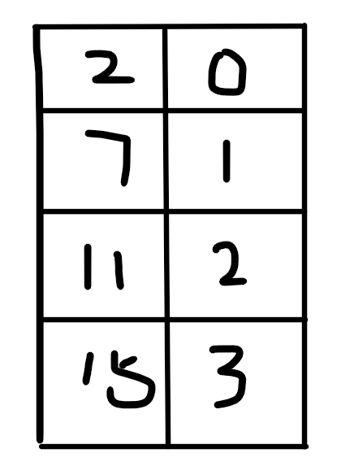

# 两数之和

**Difficulty:** Easy

**Tags:** 数组, 哈希表

## 题目描述

给定一个整数数组 `nums` 和一个整数目标值 `target`，请你在该数组中找出  **和为目标值**  *target*   的那  **两个**  整数，并返回它们的数组下标。

你可以假设每种输入只会对应一个答案，并且你不能使用两次相同的元素。

你可以按任意顺序返回答案。

## 示例 1：

```
输入：nums = [2,7,11,15], target = 9
输出：[0,1]
```
**解释:** 因为 nums[0] + nums[1] == 9 ，返回 [0, 1] 。
## 提示：
- `2 <= nums.length <= 10^4`
- `-10^9 <= nums[i] <= 10^9`
- `-10^9 <= target <= 10^9`
- **只会存在一个有效答案**
##
# 我的思路

**构建一组键值对**



构建好后，在键值对中找``target-nums[i]``对应的值

输出``{i, index[target-nums[i]]}``

### 小错误

不能找自身

加了``j != index[temp]``解决

### 知识积累
``unordered_map``的``find()``函数用法，输出的是一个迭代器


#### 代码片段
```
if (index.find(temp) != index.end() && j != index[temp]){
    return {j, index[temp]};
};
```
可以赋值给``auto``类型
```
auto this = index.find(temp);
```